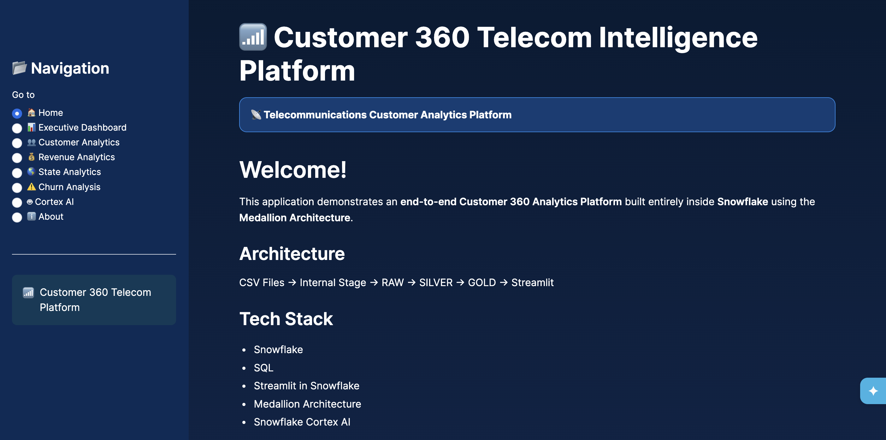
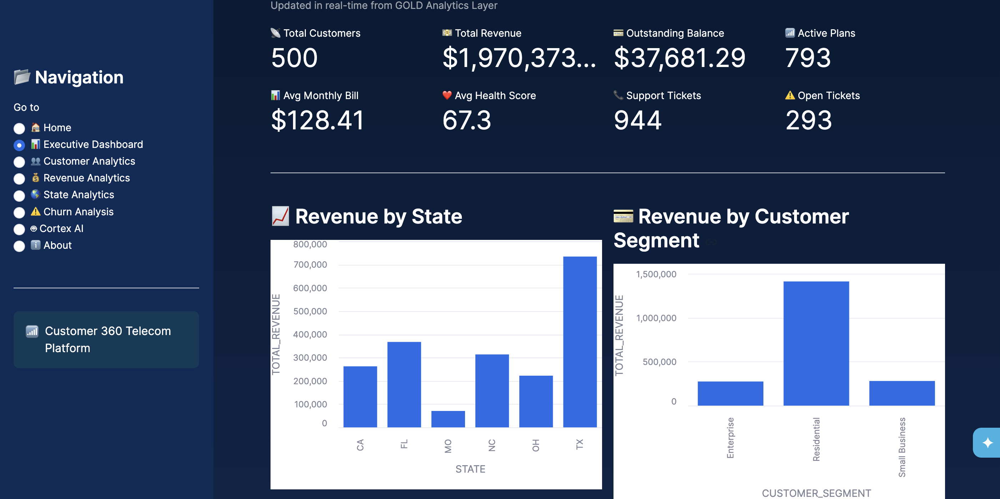
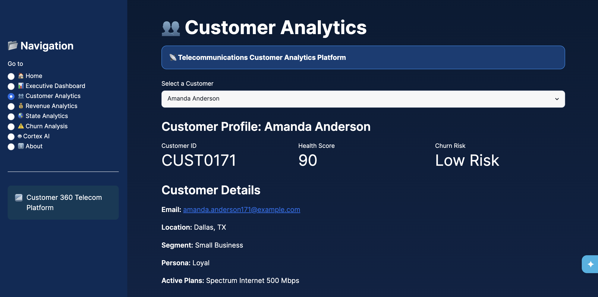
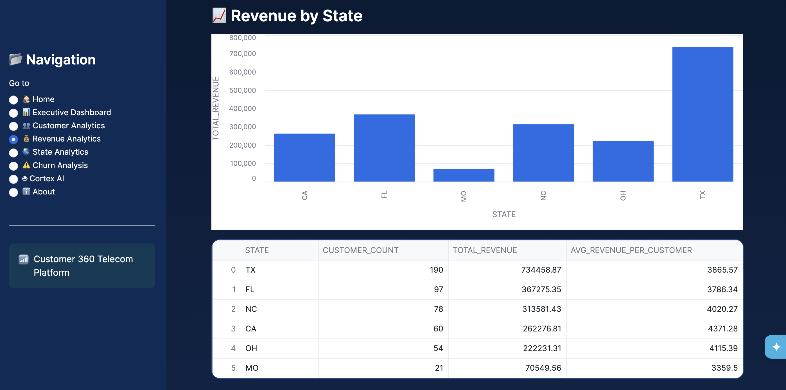
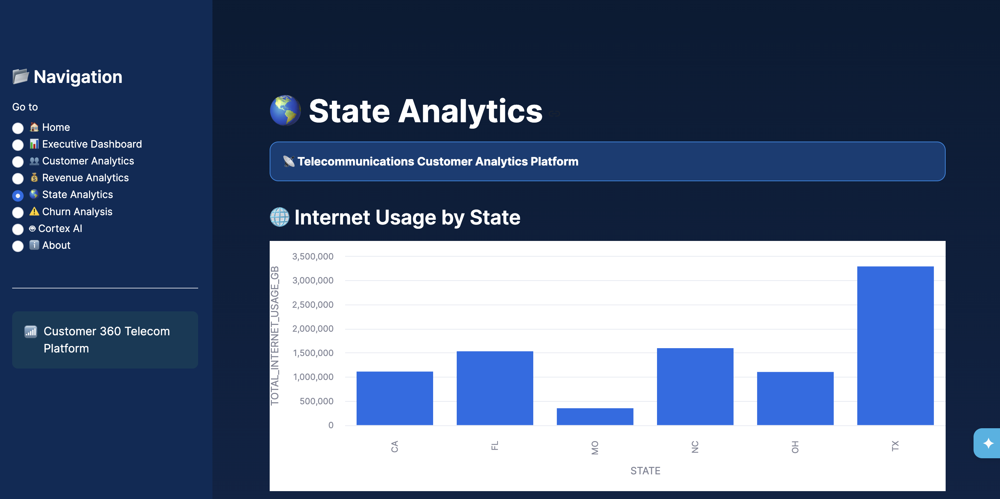
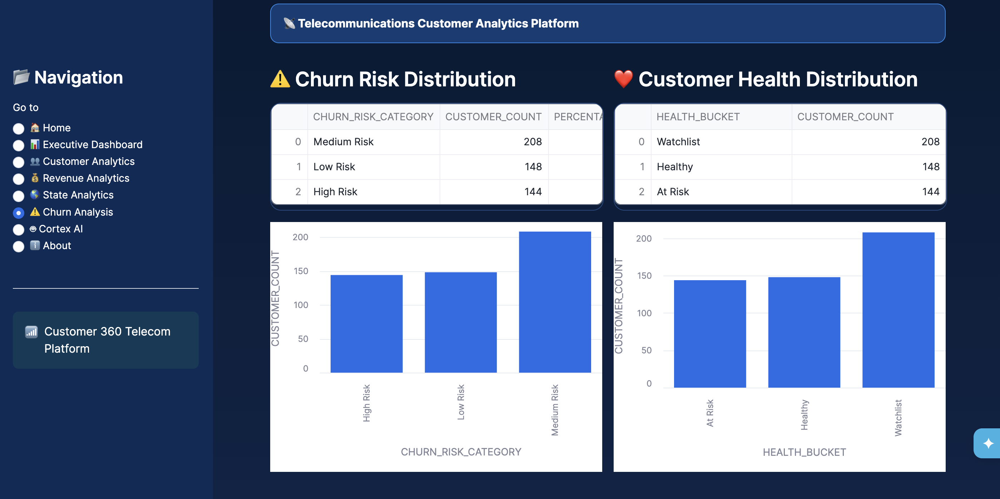
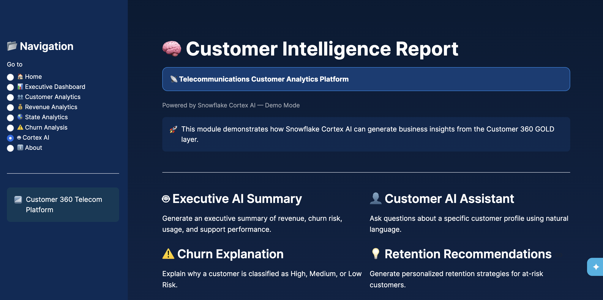
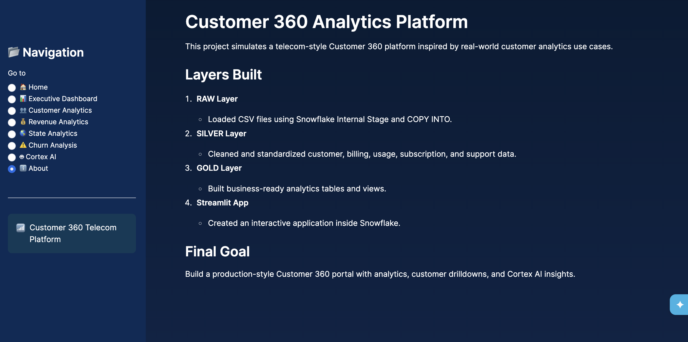

# 📊 Customer 360 Analytics Platform

> End-to-End Customer Analytics Platform built entirely inside **Snowflake** using **SQL, Snowpark, Streamlit, and Medallion Architecture**.

---

## 🚀 Project Overview

This project demonstrates how a modern Customer 360 Analytics platform can be built completely within Snowflake.

The solution ingests customer data, processes it through the **RAW → SILVER → GOLD** Medallion Architecture, and delivers interactive dashboards using **Streamlit in Snowflake**.

The platform provides business users with executive insights into:

- 📈 Revenue Performance
- 👥 Customer Analytics
- 🌎 State Analytics
- ⚠️ Churn Risk
- 🤖 AI Executive Summary (Cortex-ready)

---

# 🏗 Architecture

```
                CSV Files
                    │
                    ▼
          Snowflake Internal Stage
                    │
                    ▼
               RAW Layer
                    │
                    ▼
             SILVER Layer
                    │
                    ▼
              GOLD Layer
                    │
                    ▼
          Business Analytics Views
                    │
                    ▼
         Snowpark + Streamlit App
                    │
                    ▼
     Executive Dashboards & AI Insights
```

---

# 🛠 Tech Stack

| Technology | Purpose |
|------------|----------|
| Snowflake | Cloud Data Warehouse |
| SQL | Data Transformation |
| Snowpark | Application Logic |
| Streamlit in Snowflake | Interactive Dashboard |
| Medallion Architecture | Data Engineering |
| GitHub | Version Control |

---

# 📂 Repository Structure

```
customer360-analytics-snowflake/

│
├── data/
│     └── Sample CSV datasets
│
├── sql/
│     ├── Database creation
│     ├── Schema creation
│     ├── Warehouse creation
│     ├── RAW layer
│     ├── SILVER layer
│     ├── GOLD layer
│     └── Analytics Views
│
├── screenshots/
│
├── streamlit_app.py
├── snowflake.yml
├── pyproject.toml
└── README.md
```

---

# 📈 Dashboard Modules

## 🏠 Home

Overview of the Customer 360 Analytics Platform including architecture and technology stack.

---

## 📊 Executive Dashboard

Provides executive KPIs including:

- Total Revenue
- Active Customers
- Average Revenue Per Customer
- Customer Distribution
- Monthly Revenue Trends

---

## 👥 Customer Analytics

Customer-level insights including:

- Customer Segmentation
- Subscription Plans
- Customer Health
- Internet Usage
- Support Activity

---

## 💰 Revenue Analytics

Business revenue insights:

- Revenue by Plan
- Monthly Revenue
- Revenue Distribution
- Customer Value

---

## 🌎 State Analytics

Analyze customer usage across states:

- Internet Usage
- Mobile Usage
- TV Usage
- Revenue by State

---

## ⚠️ Churn Analysis

Identify customer churn risk using:

- Customer Health Score
- Churn Risk Category
- Support Activity
- Outstanding Balance

---

## 🤖 Cortex AI

Demonstrates AI-powered business insights.

Current Version

- Executive Summary
- Business Overview
- Key Risks
- Recommended Actions

> Note: Since Snowflake Cortex COMPLETE is unavailable on trial accounts, this project simulates AI-generated executive summaries for demonstration purposes.

---

# 🧱 Medallion Architecture

### RAW Layer

- Load CSV files
- Store source data
- Preserve original records

---

### SILVER Layer

- Data Cleaning
- Standardization
- Business Rules
- Validation

---

### GOLD Layer

Business-ready datasets powering dashboards.

Includes:

- Customer 360
- Revenue Analytics
- Churn Analytics
- State Analytics
- Executive Metrics

---

# 📷 Screenshots

## 🏠 Home



---

## 📊 Executive Dashboard



---

## 👥 Customer Analytics



---

## 💰 Revenue Analytics



---

## 🌎 State Analytics



---

## ⚠️ Churn Analysis



---

## 🤖 Cortex AI



---

## ℹ️ About



# 🎯 Key Features

✅ End-to-End Data Pipeline

✅ Medallion Architecture

✅ Snowflake SQL

✅ Snowpark

✅ Streamlit Dashboard

✅ Interactive Analytics

✅ Executive KPIs

✅ Churn Analytics

✅ Customer Segmentation

✅ AI Executive Summary

---

# 🔮 Future Enhancements

- Live Snowflake Cortex Integration
- Customer-level AI Assistant
- Predictive Churn Modeling
- Revenue Forecasting
- Natural Language Analytics
- Role-Based Dashboard Security

---

# 👨‍💻 Author

**Tirthesh Kode**

MS Information Systems  
University of Texas at Arlington

GitHub:
https://github.com/tirthesh99

LinkedIn:
(Add your LinkedIn URL)

---

# ⭐ If you found this project useful, consider giving it a star!
